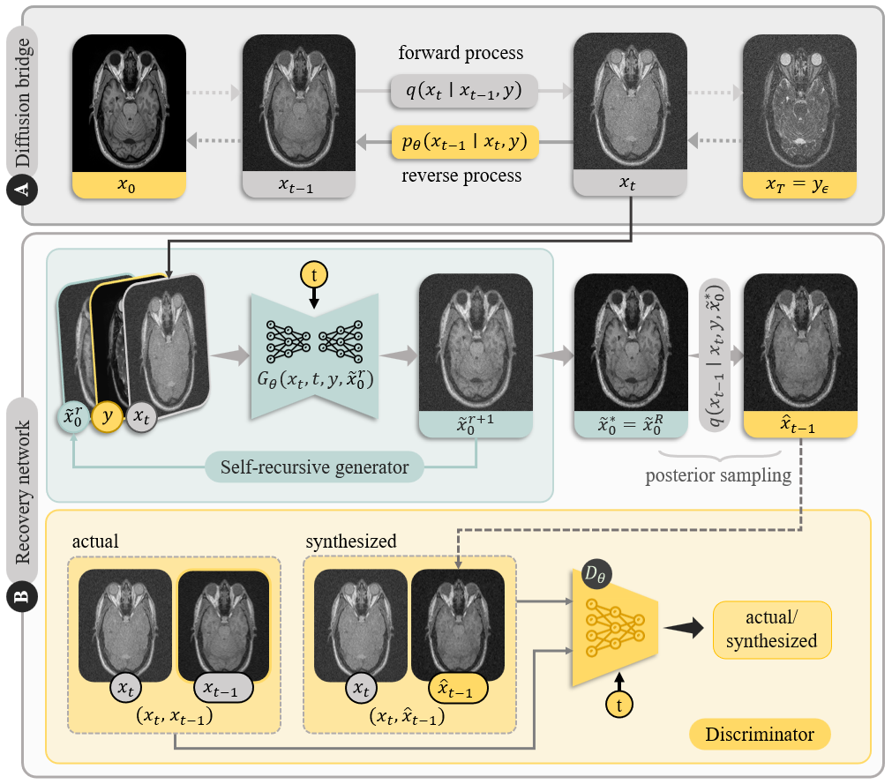

<hr>
<h1 align="center">
  SelfRDB <br>
  <sub>Self-Consistent Recursive Diffusion Bridge for Medical Image Translation</sub>
</h1>

<div align="center">
  <a href="https://github.com/fuat-arslan" target="_blank">Fuat&nbsp;Arslan</a><sup>1,2</sup> &ensp; <b>&middot;</b> &ensp;
  <a href="https://bilalkabas.github.io/" target="_blank">Bilal&nbsp;Kabas</a><sup>1,2</sup> &ensp; <b>&middot;</b> &ensp;
  <a href="https://onatdalmaz.com/" target="_blank">Onat&nbsp;Dalmaz</a><sup>3</sup> &ensp; <b>&middot;</b> &ensp;
  <a href="https://scholar.google.com/citations?user=VaoGQnMAAAAJ&hl=en" target="_blank">Muzaffer&nbsp;Ozbey</a><sup>4</sup> &ensp; <b>&middot;</b> &ensp;
  <a href="https://kilyos.ee.bilkent.edu.tr/~cukur/" target="_blank">Tolga&nbsp;Çukur</a><sup>1,2</sup> &ensp;
  
  <span></span>
  
  <sup>1</sup>Bilkent University &emsp; <sup>2</sup>UMRAM &emsp; <sup>3</sup>Stanford University &emsp; <sup>4</sup>University of Illinois Urbana-Champaign <br>
</div>
<hr>

<h3 align="center">[<a href="https://arxiv.org/abs/2405.06789">arXiv</a>]</h3>

Official PyTorch implementation of **SelfRDB**, a novel diffusion bridge model for multi-modal medical image synthesis that employs a novel forward process with soft-prior, and self-consistent recursion in reverse process. Our novel noise scheduling with monotonically increasing variance towards the end-point, i.e. soft-prior, boosts generalization performance and facilitates information transfer between the two modalities. To further enhance sampling accuracy in each reverse step, SelfRDB utilizes a novel sampling procedure where the network recursively generates a transient-estimate of the target image until convergence onto a self-consistent solution.

<p align="center">
  
</p>


## ⚙️ Installation

This repository has been developed and tested with `CUDA 11.7` and `Python 3.8`. Below commands create a conda environment with required packages. Make sure conda is installed.

```
conda env create --file requirements.yaml
conda activate selfrdb
```

## 🗂️ Prepare dataset

The default data set class `NumpyDataset` requires the following folder structure to organize the data set. Modalities (T1, T2, etc.) are separated by folders, splits (train, val, test) are organized as subfolders which include 2D images: `slice_0.npy`, `slice_1.npy`, ... To use your custom data set class, set `dataset_class` to your own implementation in `dataset.py` by inheriting from the `BaseDataset` class.

```
<dataset>/
├── <modality_a>/
│   ├── train/
│   │   ├── slice_0.npy
│   │   ├── slice_1.npy
│   │   └── ...
│   ├── test/
│   │   ├── slice_0.npy
│   │   └── ...
│   └── val/
│       ├── slice_0.npy
│       └── ...
├── <modality_b>/
│   ├── train/
│   ├── test/
│   └── val/
├── ...
  
```

## 🏃 Training

Run the following command to start/resume training. Model checkpoints are saved under `logs/$EXP_NAME/version_x/checkpoints` directory, and sample validation images are saved under `logs/$EXP_NAME/version_x/val_samples`. The script supports both single and multi-GPU training. By default, it runs on a single GPU. To enable multi-GPU training, set `--trainer.devices` argument to the list of devices, e.g. `0,1,2,3`.

```
python main.py fit \
    --config config.yaml \
    --trainer.logger.name $EXP_NAME \
    --data.dataset_dir $DATA_DIR \
    --data.source_modality $SOURCE \
    --data.target_modality $TARGET \
    --data.train_batch_size $BS_TRAIN \
    --data.val_batch_size $BS_VAL \
    [--trainer.max_epoch $N_EPOCHS] \
    [--ckpt_path $CKPT_PATH] \
    [--trainer.devices $DEVICES]

```

### Argument descriptions

| Argument                    | Description                                                                                                                    |
|-----------------------------|--------------------------------------------------------------------------------------------------------------------------------|
| `--config`                  | Config file path.                                                                                                              |
| `--trainer.logger.name`     | Experiment name.                                                                                                               |
| `--data.dataset_dir`        | Data set directory.                                                                                                            |
| `--data.source_modality`    | Source modality, e.g. 'T1', 'T2', 'PD'. Should match the folder name for that modality.                                        |
| `--data.train_batch_size`   | Train set batch size.                                                                                                          |
| `--data.val_batch_size`     | Validation set batch size.                                                                                                     |
| `--trainer.max_epoch`       | [Optional] Number of training epochs (default: 50).                                                                            |
| `--ckpt_path`               | [Optional] Model checkpoint path to resume training.                                                                           |
| `--trainer.devices`         | [Optional] Device or list of devices. For multi-GPU set to the list of device ids, e.g `0,1,2,3` (default: `[0]`).             |


## 🧪 Testing

Run the following command to start testing. The predicted images are saved under `logs/$EXP_NAME/version_x/test_samples` directory. By default, the script runs on a single GPU. To enable multi-GPU testing, set `--trainer.devices` argument to the list of devices, e.g. `0,1,2,3`.

```
python main.py test \
    --config config.yaml \
    --data.dataset_dir $DATA_DIR \
    --data.source_modality $SOURCE \
    --data.target_modality $TARGET \
    --data.test_batch_size $BS_TEST \
    --ckpt_path $CKPT_PATH
```

### Argument descriptions

Some arguments are common to both training and testing and are not listed here. For details on those arguments, please refer to the training section.

| Argument                    | Description                                |
|-----------------------------|--------------------------------------------|
| `--data.test_batch_size`    | Test set batch size.                       |
| `--ckpt_path`               | Model checkpoint path.                     |

## 🦁 Model Zoo
Refer to the testing section above to perform inference with the checkpoints. PSNR (dB) and SSIM (%) are listed as mean ± std across the test set.

| Dataset   | Task      | PSNR               | SSIM                | Checkpoint                                                                                              |
|-----------|-----------|--------------------|---------------------|---------------------------------------------------------------------------------------------------------|
| IXI       | T2→T1     | 31.63 ± 1.53       | 95.64 ± 1.12        | [Link](https://github.com/icon-lab/SelfRDB/releases/download/v1.0.0/ixi_t2_t1.ckpt)                   |
| IXI       | T1→T2     | 31.28 ± 1.56       | 95.03 ± 1.27        | [Link](https://github.com/icon-lab/SelfRDB/releases/download/v1.0.0/ixi_t1_t2.ckpt)                   |
| IXI       | PD→T1     | 31.23 ± 1.22       | 95.64 ± 0.99        | [Link](https://github.com/icon-lab/SelfRDB/releases/download/v1.0.0/ixi_pd_t1.ckpt)                   |
| IXI       | T1→PD     | 32.17 ± 1.57       | 95.15 ± 0.99        | [Link](https://github.com/icon-lab/SelfRDB/releases/download/v1.0.0/ixi_t1_pd.ckpt)                   |
| BRATS     | T2→T1     | 28.85 ± 1.48       | 93.70 ± 1.87        | [Link](https://github.com/icon-lab/SelfRDB/releases/download/v1.0.0/brats_t2_t1.ckpt)                 |
| BRATS     | T1→T2     | 27.58 ± 1.88       | 92.99 ± 2.44        | [Link](https://github.com/icon-lab/SelfRDB/releases/download/v1.0.0/brats_t1_t2.ckpt)                 |
| BRATS     | FLAIR→T2  | 26.85 ± 1.75       | 91.66 ± 2.72        | [Link](https://github.com/icon-lab/SelfRDB/releases/download/v1.0.0/brats_flair_t2.ckpt)              |
| BRATS     | T2→FLAIR  | 27.98 ± 1.80       | 90.01 ± 2.70        | [Link](https://github.com/icon-lab/SelfRDB/releases/download/v1.0.0/brats_t2_flair.ckpt)              |
| CT        | T2→CT     | 29.18 ± 2.18       | 93.28 ± 1.99        | [Link](https://github.com/icon-lab/SelfRDB/releases/download/v1.0.0/ct_t2_ct.ckpt)                    |
| CT        | T1→CT     | 27.55 ± 3.32       | 92.29 ± 6.32        | [Link](https://github.com/icon-lab/SelfRDB/releases/download/v1.0.0/ct_t1_ct.ckpt)                    |

## ✒️ Citation
You are encouraged to modify/distribute this code. However, please acknowledge this code and cite the paper appropriately.
```
@article{arslan2024selfconsistent,
  title={Self-Consistent Recursive Diffusion Bridge for Medical Image Translation}, 
  author={Fuat Arslan and Bilal Kabas and Onat Dalmaz and Muzaffer Ozbey and Tolga Çukur},
  year={2024},
  journal={arXiv:2405.06789}
}
```


<hr>

Copyright © 2024, ICON Lab.
